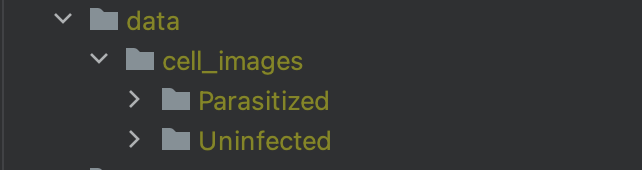

# PyDVL @ PyData 2024 Berlin
<p align="center" style="text-align:center;">
    
</p>

These are the materials for the 
[pyDVL](https://www.pydvl.org) 
presentation held on March 22nd, 2024 at
PyData Berlin.

## Detecting mislabelled images with pyDVL

In this example we use Influence Functions with pyDVL to detect mislabelled
images in a [**NIH
dataset**](https://www.kaggle.com/iarunava/cell-images-for-detecting-malaria)
with ~28K images for malaria screening.

To run the code, create a virtual environment and install the requirements:

```shell

python -m venv venv
source venv/bin/activate
pip install -r requirements.txt
```

You will also need to create a kaggle API token to be benefit from the automatic
download of the dataset. You can create a token in your Kaggle account settings
and save it in a file called `kaggle.json` under `~/.kaggle/`.

If you would like to download the data manually, make sure the result looks like this:
<p >
    
</p>

You can the run the experiment with:

```shell
python run_evaluation_malaria.py
```

You might need to change the batch sizes to fit in your GPU RAM, both for the
training of the model in the main section of `run_evaluation_malaria.py`, as
well as for the computation of the influence functions in `compute_infuences()`
in the same file.

The script trains a pytorch lightning model, computes corresponding
influence values and generates histograms and plots. By default, the results
are persisted in the folder `results` on the top-level of the repository, which
can be configured via `config.py`

## Slides

The slides use [Slidev](https://sli.dev/). To start the slideshow run:

```shell
cd slides
npm install
npm run dev
```

There's a live reload server running at http://localhost:3030. Edit
[slides.md](./slides/slides.md) to see the changes.

The slides are deployed with Netlify to
[pydata2024.pydvl.org](https://pydata2024.pydvl.org/)
upon every push to master.

To export them as PDF run (from the slides folder):

```shell
npm run export -- --with-clicks
```

If using VSCode, it is recommended to open the subfolder `slides` as a workspace
to benefit from the Slidev extension.
